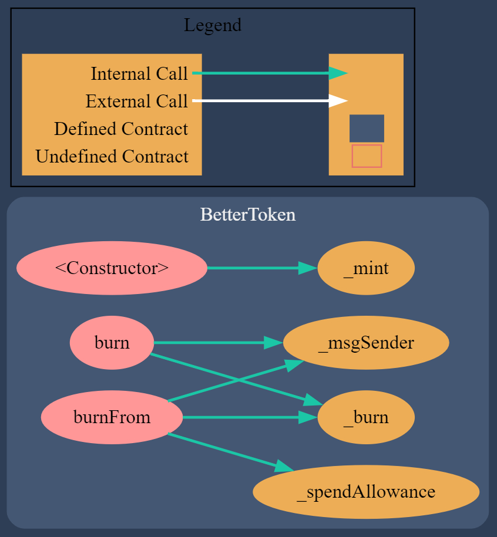
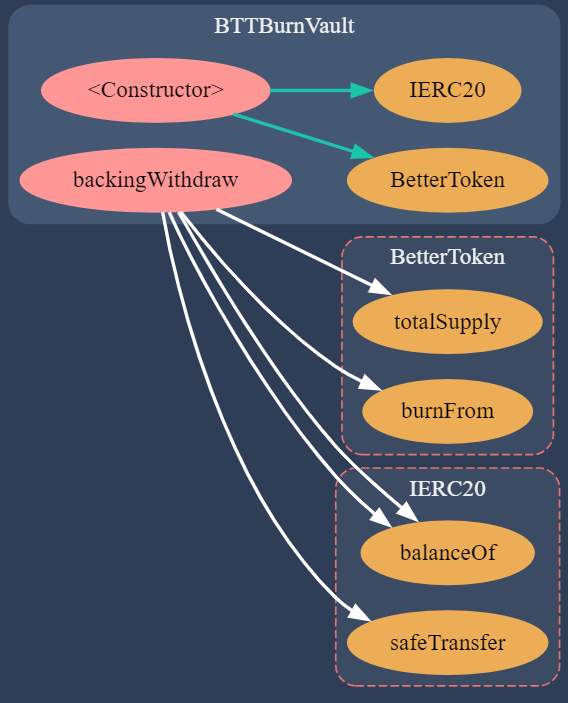
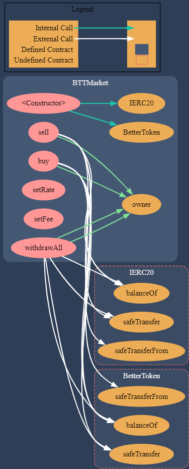

# Better Coin (BTT)

## Introduction

Better Coin (BTT) is an ERC20 token designed to work on the Arbitrum network. With a fixed supply limit of 21,000,000 tokens, BTT is burnable and interacts with various smart contracts to provide a decentralized finance (DeFi) ecosystem centered around token burns and exchanges.

The primary objective of the BTT token and its ecosystem of smart contracts is to create a share system where holders can increase their value by receiving a proportional share of the system's earnings. This is achieved through the BTTBurnVault, where holders can burn their tokens at any time to receive their share of the wBTC reserves, based on their holdings. The system's shares will be distributed through periodic direct transfers of wBTC to the BTTburnVault

As the system evolves and holders burn their tokens, the next earnings are distributed among fewer BTT tokens, thereby increasing the value of remaining tokens relative to the BTTBurnVault. This not only improves the value against the BurnVault but also enhances the overall distribution rate, rewarding holders who continue to hold and benefit from a higher share of the system's earnings.

## 1. Features

- **Burnable ERC20 Token**: BTT tokens can be burned to withdraw a proportional amount of wBTC from the BTTBurnVault.
- **Fixed Supply**: The total supply of BTT tokens is capped at 21,000,000, ensuring scarcity and value preservation.
- **BTTBurnVault**: A smart contract that allows BTT holders to burn their tokens in exchange for wBTC, based on the current token reserve and total supply.
- **BTTMarket**: A centralized marketplace to buy and sell BTT tokens at rates set by the administrator, providing liquidity and easy exchange options for token holders.

## Contract Architecture

To read the entire API definition refer to [API DOCUMENTATION](API.md)

### BetterCoin Contract

**Overview**:  
BetterCoin (BTT) is a burnable ERC20 token with a limited supply, designed to work on the Arbitrum network. This contract manages the minting and burning of BTT tokens, with a capped total supply of 21,000,000 tokens.

### 1.1 BTTBurnVault Contract

This contract allows users to burn their BTT in exchange for wBTC stored in the vault. The exchange rate adjusts dynamically based on the BTT total supply and the current wBTC reserves, ensuring that all token holders receive the same value per token burned at a defined moment.

### 1.2 BTTMarket Contract

Operates as a centralized exchange for BTT, where users can buy or sell BTT tokens against a market token at administratively set rates. This contract includes transaction fees and provides functionalities for rate and fee adjustments by the contract owner.

## 2. Functional Requirements

### 2.1 Roles

- **Admin**: Manages contract settings, such as setting rates and fees in BTTMarket, and can perform administrative tasks like withdrawing tokens from the contracts.
- **User**: Interacts with the contracts by buying, selling, burning BTT tokens, and withdrawing wBTC from the BTTBurnVault.

### 2.2 Features

- **Token Minting and Burning**: BTT tokens are minted upon contract deployment and can be burned by users to withdraw wBTC.
- **Proportional Withdrawals**: Users can burn BTT tokens to withdraw a proportional amount of wBTC based on the total supply and wBTC balance.
- **Centralized Marketplace**: Users can buy and sell BTT tokens at administratively set rates.
- **Adjustable Rates and Fees**: Admin can adjust the exchange rates and transaction fees in the BTTMarket contract.

### 2.3 Use Cases

1. **Burning BTT for wBTC**:
   - **User**: Burns BTT tokens to withdraw a proportional amount of wBTC from the BTTBurnVault.
   - **Contract Interaction**: Calls `backingWithdraw` function in BTTBurnVault.
2. **Buying BTT**:

   - **User**: Buys BTT tokens using market tokens.
   - **Contract Interaction**: Calls `buy` function in BTTMarket.

3. **Selling BTT**:

   - **User**: Sells BTT tokens to receive market tokens.
   - **Contract Interaction**: Calls `sell` function in BTTMarket.

4. **Admin Adjusts Rates and Fees**:
   - **Admin**: Adjusts the price of BTT tokens and the transaction fees.
   - **Contract Interaction**: Calls `setRate` and `setFee` functions in BTTMarket.

## 3. Technical Requirements

### 3.1 Contract Information

#### 3.1.1 BetterCoin.sol

- **Assets**:
  - `MAX_SUPPLY`: The maximum supply of BTT tokens.
- **Events**:
  - `Transfer`: Emitted when tokens are transferred.
  - `Approval`: Emitted when an approval is made for token allowance.
- **Functions**:
  - `constructor()`: Mints the total supply to the deployer.
  - `burn(uint256 amount)`: Burns a specified amount of tokens from the caller's balance.
  - `burnFrom(address account, uint256 amount)`: Burns a specified amount of tokens from a specific account using the caller's allowance.

#### 3.1.2 BTTBurnVault.sol

- **Assets**:
  - `wbtc`: The wBTC token contract.
  - `btt`: The BTT token contract.
- **Events**:
  - `burnMade(uint256 bttBurned, uint256 wbtcWithdrew)`: Emitted when BTT tokens are burned and wBTC is withdrawn.
- **Functions**:
  - `constructor(address _addrBtt, address _addrWbtc)`: Sets the BTT and wBTC contract addresses.
  - `backingWithdraw(uint256 amount)`: Burns BTT tokens and withdraws a proportional amount of wBTC.

#### 3.1.3 BTTMarket.sol

- **Assets**:
  - `btt`: The BTT token contract.
  - `marketToken`: The market token contract.
- **Events**:
  - `userBought(uint256 marketTokenFromUser, uint256 bttToUser)`: Emitted when a user buys BTT.
  - `userSold(uint256 marketTokenToUser, uint256 bttFromUser)`: Emitted when a user sells BTT.
- **Functions**:
  - `constructor(address _addrBtt, address _addrMarketToken, uint256 _marketTokenPer100Btt, uint256 _fee)`: Sets the contract addresses, initial rate, and fee.
  - `buy(uint256 amount)`: Allows a user to buy BTT tokens with market tokens.
  - `sell(uint256 amount)`: Allows a user to sell BTT tokens for market tokens.
  - `setRate(uint256 _marketTokenPer100Btt)`: Sets the price of 100 BTT tokens in market tokens.
  - `setFee(uint256 _fee)`: Sets the transaction fee for selling BTT tokens.
  - `withdrawAll()`: Withdraws all tokens from the contract.

#### 3.2 Architecture Overview

The following charts provides a general view of the contracts structure and interactions





## Installation

After cloning the repository, run:

```sh
npm install
```

## Testing

We have a complete test suite that covers all the smart contracts and their functionalities located in `./test/`.

After installing everything, run:

```sh
npx hardhat test
```

For coverage testing:

```sh
npx hardhat coverage
```

## Deployment

We've created an Ignition module for each contract located in `./ignition/modules`. Each module has the default parameter definitions of the addresses required for mainnet deployment.

Additionally, we've created two custom deployment scripts:

### deploy4Mainnet.ts

This script:

- Uses the Ignition modules to deploy the contracts on the mainnet with the default parameters.

### deploy4Testing.ts

This script:

- Deploys test versions of the USDT and wBTC tokens to be used in testing.
- Deploys the BTT contracts using the Ignition modules with testing parameters.

## Deployment Modules

### ./ignition/modules

- Contains the Ignition modules for each contract with default parameters for mainnet deployment.
- Transfers ownership of the contracts to the intended owners.

### Custom Deployment Scripts

#### deploy4Mainnet.ts

This script:

- Uses the Ignition modules to deploy the contracts on the mainnet with the default parameters.

#### deploy4Testing.ts

This script:

- Deploys test versions of the USDT and wBTC tokens to be used in testing.
- Deploys the BTT contracts using the Ignition modules with testing parameters.
